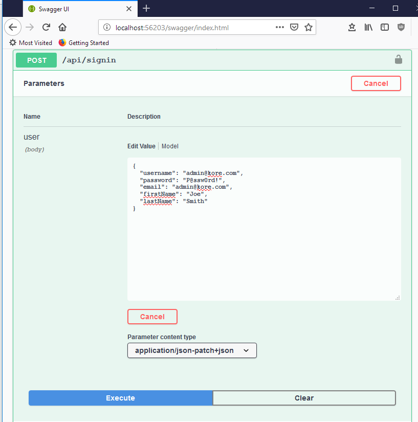
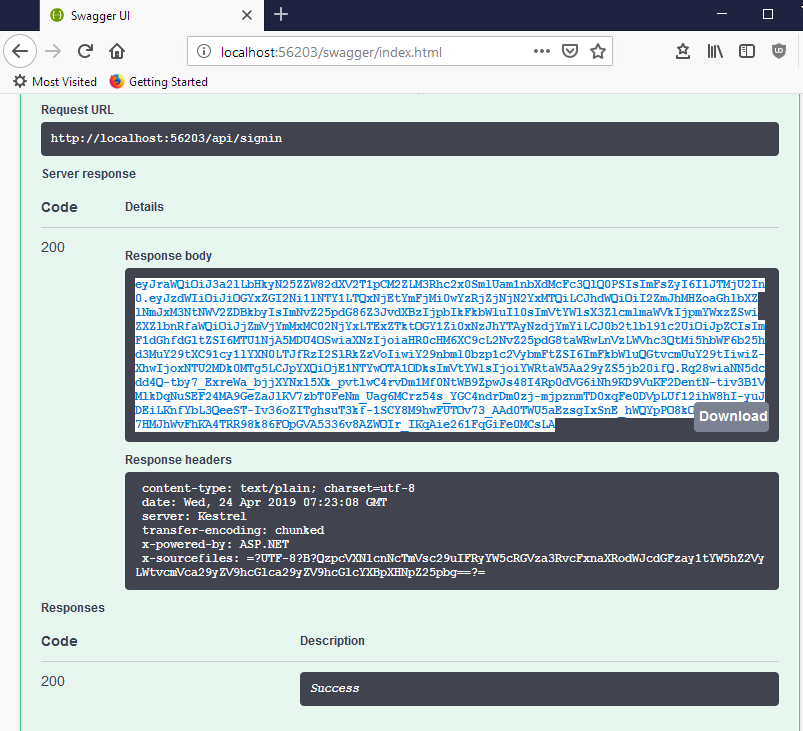

# Task Manager

[Google Drive](https://drive.google.com/open?id=152iXPBzXkmBrEiGeA1CxkhKxQQXTxXR6)

## Test API

Use Postman OR launch kore_api.sln and navigate to http://localhost:56203/swagger/

- Sign In

- Copy Bearer token

- Click on Authorize button at the top and enter in Bearer followed by a space and then the token.

## Getting Started

### Prerequisites

### Installing

## Deployment

## Built With

## Authors

## Acknowledgments

